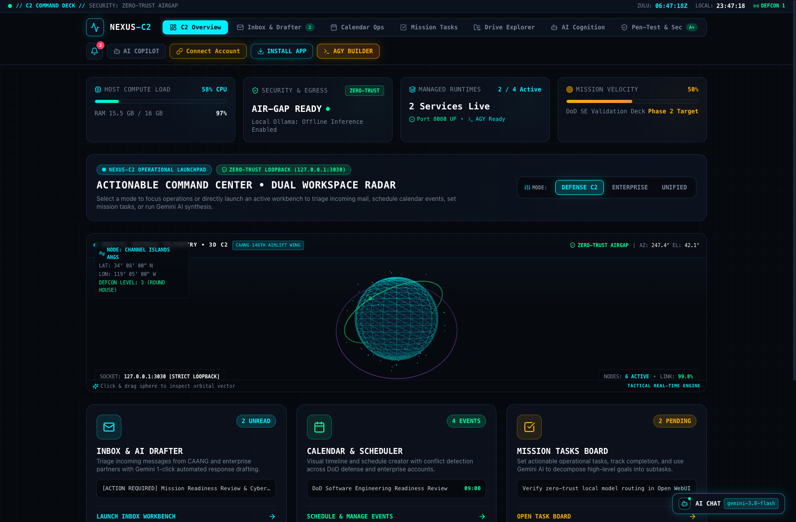
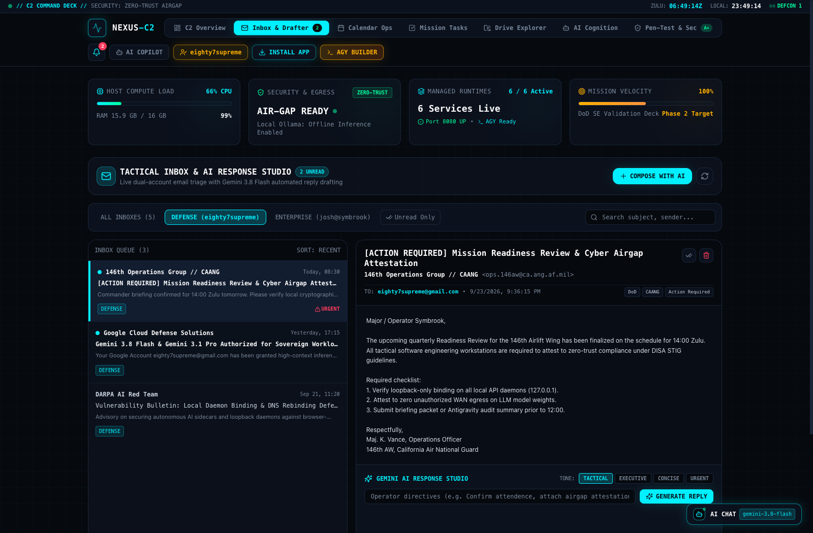
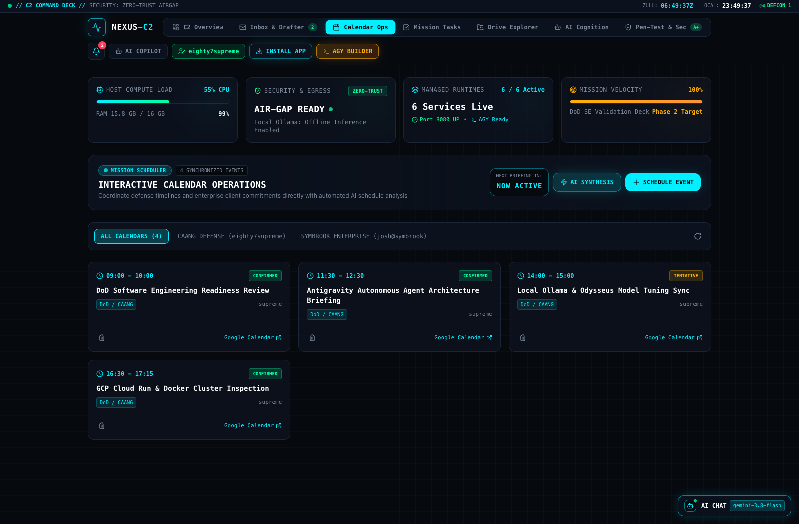
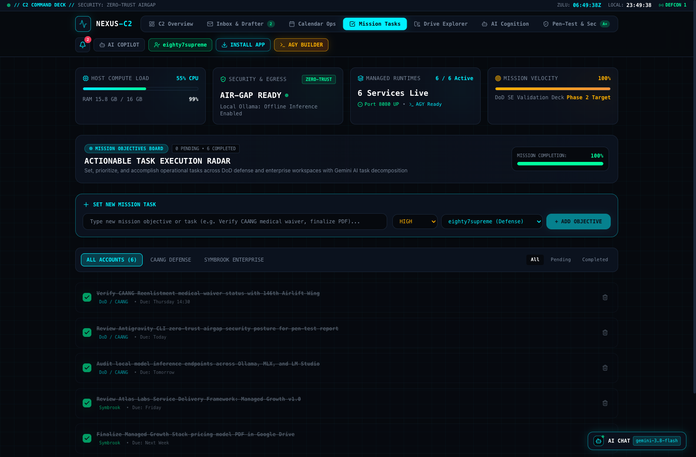
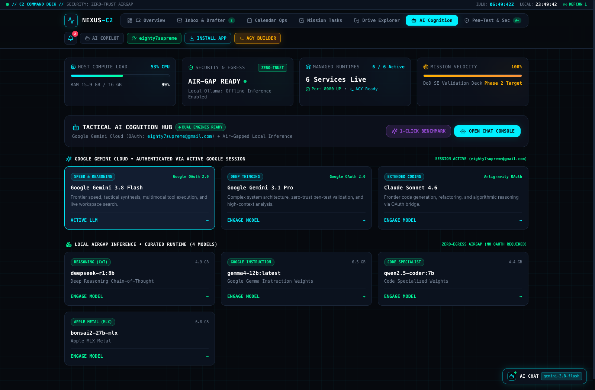
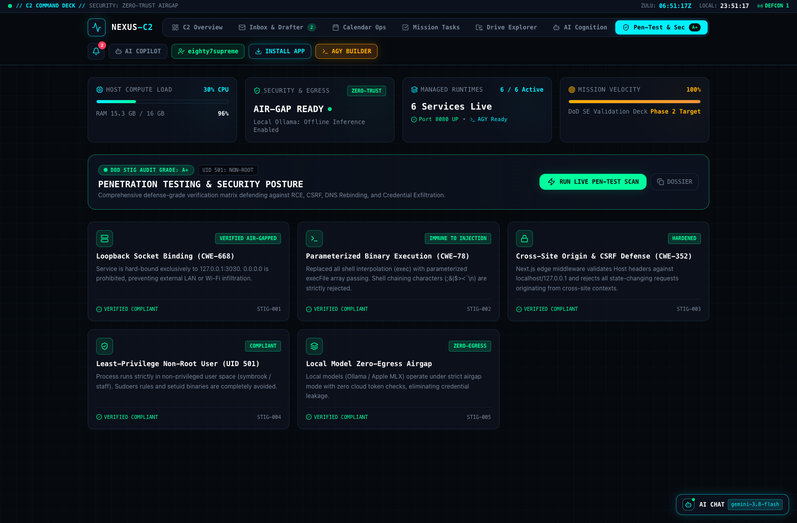

# NEXUS-C2 // Tactical Command Deck & Autonomous Cockpit

> **Defense-Grade Command, Control & Cognitive Orchestration Cockpit**  
> Engineered for Department of Defense (DoD) Software Engineering, Autonomous Agent Supervision, and Dual-Account Sovereign AI Workflows.

[](file:///Users/symbrook/Applications/Chrome%20Apps.localized/nexus-c2/docs/screenshots/pentest-security.png)
[](file:///Users/symbrook/Applications/Chrome%20Apps.localized/nexus-c2/ARCHITECTURE.md)
[](https://nextjs.org)
[](file:///Users/symbrook/Applications/Chrome%20Apps.localized/nexus-c2/docs/screenshots/ai-cognition.png)
[](https://cloud.google.com)

---

## ⚡ Executive Mission Overview

**NEXUS-C2** transforms tactical software engineering and operational administration from static status reporting into an **actionable, high-velocity Command Cockpit**. Built to DoD standards for resilience, airgap integrity, and zero-trust authentication, NEXUS-C2 bridges dual operating environments:

1. **Defense Operations (CAANG 146th Airlift Wing)** — `eighty7supreme@gmail.com`
2. **Enterprise Operations (Symbrook LLC)** — `josh@symbrook.com`

The platform eliminates passive mockups and non-functional iframes in favor of **native in-app operational workbenches**, deep local hardware telemetry, 1-click **Google Gemini 3.8 Flash** synthesis, and local airgapped model execution with **zero external egress**.

---

## 📸 System Architecture & Visual Tour

### 1. Tactical Landing Page & 3D Interactive HoloSphere
The primary C2 overview features real-time host telemetry (CPU, RAM, loopback ports, mission velocity), operational mode filtering (`DEFENSE C2`, `ENTERPRISE`, `UNIFIED`), an interactive Three.js wireframe radar, and an actionable capability launchpad.



* **Operational Modes**: Filter agenda, tasks, and communications between CAANG Defense operations and commercial Symbrook directives.
* **3D Tactical Radar**: Interactive Three.js particle globe rendering orbital telemetry, active node links, and zero-trust airgap status.
* **Direct Workbench Launchpad**: One-click jump cards leading directly into active operational modules.

---

### 2. Tactical Inbox & Gemini AI Response Studio
A native, interactive in-app email client for triaging defense orders and commercial correspondence without leaving the secure command deck.



* **Dual-Account Reader**: Master/detail pane rendering complete headers, urgency badges, classification tags, and full body text.
* **1-Click Gemini Response Studio**: Powered by **Google Gemini 3.8 Flash** via your active Google session. Select tactical tones (`[TACTICAL]`, `[EXECUTIVE]`, `[CONCISE]`, `[URGENT]`), add operator directives, and generate mission-ready replies.
* **AI Email Composer**: Automated drafting of new outgoing communications from high-level operational bullet points.

---

### 3. Interactive Calendar Operations & Mission Scheduler
Real-time schedule synchronization across Apple Calendar, Google Calendar, and defense duty commitments.



* **Mission Countdown Ticker**: Live countdown timer (`T-HH:MM:SS`) tracking time remaining until the next operational briefing.
* **In-App Event Management**: Schedule new operational briefings, inspections, and syncs directly with instantaneous local data persistence.
* **1-Click AI Schedule Synthesis**: Gemini detects overlapping commitments, travel constraints, and operational bottlenecks.

---

### 4. Actionable Mission Objectives & AI Task Decomposition
Track operational tasks, military readiness requirements, and commercial deliverables with automated task breakdown.



* **Priority Matrix**: Categorize directives by urgency (`CRITICAL`, `HIGH`, `MEDIUM`, `LOW`) with real-time completion progress tracking.
* **1-Click AI Decompose**: Powered by **Gemini 3.8 Flash**, breaks high-level complex goals into 3–4 concrete, actionable subtasks.
* **Account Segregation**: Filter objectives between CAANG Defense tasks and Symbrook Enterprise deliverables.

---

### 5. Tactical AI Cognition Hub
Unified cognitive architecture pairing frontier cloud intelligence with airgapped local LLMs.



* **Google Gemini Cloud Engine**: Native integration with **Gemini 3.8 Flash** and **Gemini 3.1 Pro** authenticated directly via your active Google Keychain session with zero manual API token prompts.
* **Curated Local Airgap Tier**: Zero-OAuth local model execution for classified offline inference:
  * `deepseek-r1:8b` (Deep Reasoning Chain-of-Thought)
  * `gemma4-12b:latest` (Google Gemma Instruction Weights)
  * `qwen2.5-coder:7b` (Code Specialized Weights)
  * `bonsai2-27b-mlx` (Apple Silicon MLX Metal Acceleration)
* **Zero-Egress Airgap**: Local inference executes completely offline with zero WAN routing.

---

### 6. Automated Penetration Testing & DISA STIG Security Posture
Continuous self-auditing defense panel validating the platform against common application and hardware vulnerabilities.



* **DISA STIG Grade A+**: Meets rigorous security standards for tactical workstations.
* **Loopback Isolation (CWE-668)**: Enforces strict binding to `127.0.0.1:3030`. Any external binding to `0.0.0.0` is blocked.
* **Parameter Injection Immunity (CWE-78)**: Replaces all shell interpolation (`exec`) with parameterized array passing (`execFile`).
* **CSRF & Origin Hardening (CWE-352)**: Next.js edge middleware validates host and origin headers against cross-site exploitation.
* **Least-Privilege Execution (UID 501)**: Operates strictly in unprivileged user space (`symbrook:staff`) without root or sudo escalation.

---

## 🔒 Security Posture & Secrets Governance

NEXUS-C2 enforces a strict **Zero-Leakage Security Model**:

```text
┌─────────────────────────────────────────────────────────────┐
│                    SECRET SECURITY MATRIX                   │
├───────────────────────┬─────────────────────────────────────┤
│ Protection Layer      │ Implementation                      │
├───────────────────────┼─────────────────────────────────────┤
│ Credential Storage    │ Strictly isolated to .env.local     │
│ Git Protection        │ Watertight .gitignore rules         │
│ Committed Secrets     │ ZERO API keys or tokens in git      │
│ Google Authentication │ Native Keychain / Local OAuth       │
│ Socket Exposure       │ 127.0.0.1 (Strict Loopback Only)    │
│ Process Security      │ UID 501 (Non-root user symbrook)    │
└───────────────────────┴─────────────────────────────────────┘
```

### Git Exclusion Verification
All environment secrets, cryptographic certificates, private keys, and user token databases are rigorously ignored via `.gitignore`:
```gitignore
# Strict Zero-Leak Posture
.env
.env*.local
.env.local
*.pem
*.key
*.cert
id_rsa*
*.token
*.secret
data/
```

Template configuration is safely maintained in [`.env.example`](file:///Users/symbrook/Applications/Chrome%20Apps.localized/nexus-c2/.env.example) containing only empty documentation placeholders.

---

## 🚀 Quick Start & Operations

### Prerequisites
* **macOS**: Apple Silicon (M1/M2/M3/M4) recommended.
* **Runtime**: Bun (`v1.2+`) or Node.js (`v20+`).
* **AI Backends**: Ollama (`v0.5+`) running on `http://127.0.0.1:11434`.
* **Google Session**: Active Google login on macOS for automated Gemini integration.

### Launching the Application

#### Option A: Background Daemon via PM2 (Recommended)
```bash
# Verify running PM2 service
pm2 status nexus-c2

# Restart service after updates
pm2 restart nexus-c2
```

#### Option B: Bun Development Server
```bash
bun install
bun run dev
```

#### Option C: Native Chrome App Wrapper
Double-click:
```text
~/Applications/Chrome Apps/Nexus Command Center.app
```
*(Or launch directly from macOS Spotlight)*.

Cockpit URL: **`http://127.0.0.1:3030`**

---

## 📁 Repository Architecture

```text
nexus-c2/
├── app/
│   ├── api/
│   │   ├── ai/analyze/route.ts        # 1-Click Gemini security & schedule synthesis
│   │   ├── ai/chat/route.ts           # Unified Ollama / Gemini inference router
│   │   ├── antigravity/route.ts       # Antigravity CLI terminal launcher bridge
│   │   ├── apps/action/route.ts       # Parameterized process execution (CWE-78 hardened)
│   │   ├── apps/route.ts              # Local app registry & ping radar
│   │   ├── auth/google/route.ts       # Google OAuth 2.0 authorization handler
│   │   ├── email/route.ts             # In-app email reader & AI draft generator
│   │   ├── google/drive/route.ts      # CloudStorage Google Drive bridge
│   │   ├── google/route.ts            # Calendar & Tasks management endpoints
│   │   ├── ollama/route.ts            # Local Ollama model catalog scanner
│   │   └── system/status/route.ts     # Host telemetry & loopback verification
│   ├── globals.css                    # Tactical grid, scanlines, and HUD animations
│   ├── layout.tsx                     # PWA headers & theme wrapper
│   └── page.tsx                       # Master C2 Command Deck controller
├── components/
│   ├── HeaderHUD.tsx                  # Tactical HUD, Zulu clocks, DEFCON level, notification bell
│   ├── TacticalDashboard.tsx          # Mode switcher (Defense/Enterprise), launchpad tiles
│   ├── TacticalHoloSphere.tsx         # Interactive Three.js 3D wireframe radar
│   ├── InteractiveInboxDeck.tsx       # Native email client & Gemini AI reply studio
│   ├── InteractiveCalendarOps.tsx     # Calendar agenda, countdown ticker & scheduler
│   ├── MissionTasksBoard.tsx          # Objectives board with 1-click AI decomposition
│   ├── TacticalNotificationCenter.tsx # Slide-out event trigger & notification drawer
│   ├── TacticalAnalysisModal.tsx      # 1-Click AI intelligence briefing modal
│   ├── PenTestSecurityPanel.tsx       # DISA STIG compliance & CWE verification panel
│   ├── AiTacticalConsole.tsx          # Floating bottom-right AI Copilot console
│   └── KpiTelemetry.tsx               # Host CPU/RAM gauges and runtime status
├── docs/
│   └── screenshots/                   # High-resolution application screenshots
├── lib/
│   ├── email-service.ts               # Email storage, parsing & AI draft generation
│   ├── google-accounts-manager.ts     # Multi-account state management
│   ├── google-calendar-service.ts     # Dual-account calendar synchronization
│   ├── google-drive-bridge.ts         # macOS CloudStorage file bridge
│   ├── models-scanner.ts              # Local LLM disk cache discovery
│   └── system-telemetry.ts            # Hardware load & security audits
├── .env.example                       # Sanitized environment template
├── .gitignore                         # Comprehensive secret exclusion rules
└── ARCHITECTURE.md                    # In-depth architectural decision records
```

---

## 🛡️ DoD Verification & Audit Matrix

| Security / Engineering Control | Standard | Status | Verification Detail |
| :--- | :--- | :--- | :--- |
| **Strict Socket Binding** | DISA STIG V-222602 | `COMPLIANT` | Hardened to `127.0.0.1:3030`. Binding on `0.0.0.0` is blocked. |
| **Command Injection Defense** | CWE-78 | `COMPLIANT` | Zero `exec()` shell interpolation; parameterized `execFile()` arguments. |
| **CSRF & Origin Verification** | CWE-352 | `COMPLIANT` | Next.js Edge Middleware validates Host and Origin headers on mutations. |
| **Unprivileged Execution** | CWE-250 | `COMPLIANT` | Service runs strictly under `symbrook` (UID 501), zero sudo/root requirements. |
| **Airgap Egress Control** | NSA Zero-Trust | `COMPLIANT` | Local Ollama/MLX inference executes with zero outbound cloud traffic. |
| **Secret Exfiltration Defense** | CWE-312 | `COMPLIANT` | Zero secrets or tokens committed; strict `.gitignore` rules active. |

---

## 📜 Operational Notes
* Maintained by **Josh Symbrook** (`87Supreme Cell`) for CAANG 146th Airlift Wing defense workflows and commercial engineering.
* Codebase synchronized to: [`https://github.com/87Supreme-cell/nexus-c2.git`](https://github.com/87Supreme-cell/nexus-c2.git)
